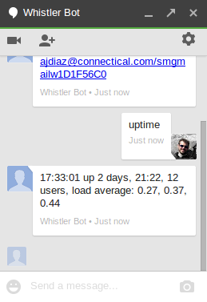

Whistler Bot
============

Whistler Bot is an XMPP bot written in python using SleekXMPP_, which is
a requirement. The bot is designed to handle some commands, and it is easy to
extend.

.. image:: https://pypip.in/v/whistler/badge.png
    :target: https://crate.io/packages/whistler/
    :alt: Latest PyPI version

.. image:: https://pypip.in/d/whistler/badge.png
    :target: https://crate.io/packages/whistler/
    :alt: Number of PyPI downloads

Simple usage:

.. code-block:: bash

  $ whistler  myconfig.conf

Create bot programmatically:

.. code-block:: python

    from whistler.bot import WhistlerBot
    
    bot = WhistlerBot( "myjid@myserver.com", "mypassword" )
    bot.start()

.. _SleekXMPP: https://github.com/fritzy/SleekXMPP

Extending bot
-------------
You can extend the bot functionalities, just see for example the code of the
whistler console script. In short you can add commands creating a new class
from WhistlerBot, and define new functions in the form ``cmd_<command>`` plus the
command name, for example, to handle the command *ping*.

.. code-block:: python

    from whistler.bot import WhistlerBot
    
    class MyBot(WhistlerBot):
    
        def cmd_ping(self, msg, args):
            return "pong"

Example chat
------------

Whistler allows to send private commands in usual jabber (and of course
GTalk and Google Hangouts) chat.

Also public commands are available, prefixed them with "!" (exclamation mark),
as also reply to a direct mention in the form "whistler:" or "whistler,", where
"whistler" is the nickname of the bot in the MUC::

    (Me) whistler: uptime
    (whistler) 17:33:01 up 2 days, ...

Currently Whistler support a number of features, including tweet from
command, shorting url action and so on...

You can see the mixins_ directory to see a number of examples for whistler
and how easy is to extend.

.. _mixins: https://github.com/ajdiaz/whistler/tree/master/whistler/mixins

Contributions
-------------

Any new mixin or functionality is welcome to Whistler. If you has been
developed new one or want new feature, please `send me a message` or a `pull
request`_.

.. _`send me a message`: mailto:ajdiaz@connectical.com
.. _`pull request`: https://github.com/ajdiaz/whistler/pulls
